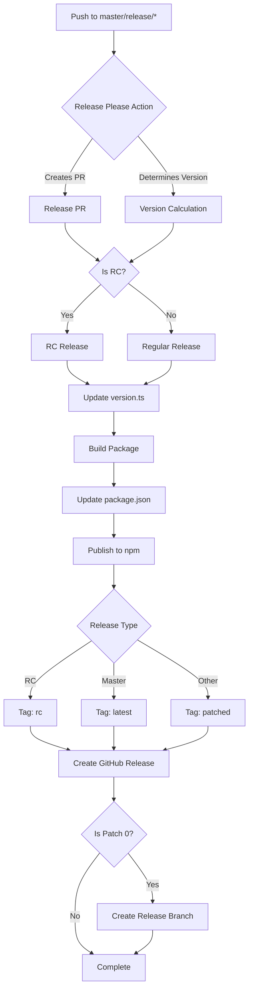

# Release Process Documentation

This document explains how the release process works for the Supabase Realtime
JavaScript client.

## Overview

The release process is automated using GitHub Actions and follows semantic
versioning principles. The process handles both regular releases and release
candidates (RCs).

## Release Types

### Regular Releases

- Triggered on pushes to `master` branch
- Follows semantic versioning (MAJOR.MINOR.PATCH)
- Creates a new release branch for patch versions (when PATCH is 0)
- Published to npm with the `latest` tag

### Release Candidates (RCs)

- Triggered on pushes to `release/*` branches
- Version format: `MAJOR.MINOR.PATCH-rc.COMMITS`
- Published to npm with the `rc` tag
- Creates a GitHub release marked as prerelease

## Release Process Flow

1. **Release Please Action**
   - Monitors commits and creates release PRs
   - Determines version numbers based on conventional commits
   - Creates release PRs when changes are ready for release

2. **Version Determination**
   - For regular releases: Uses semantic versioning (MAJOR.MINOR.PATCH)
   - For RCs: Appends `-rc.COMMITS` to the version number
   - Version is stored in `src/lib/version.ts`

3. **Package Publishing**
   - Builds the package using `npm run build`
   - Updates version numbers in package files
   - Publishes to npm with appropriate tags:
     - `latest` for main branch releases
     - `rc` for release candidates
     - `patched` for other releases

4. **GitHub Release Creation**
   - For RCs:
     - Creates a prerelease on GitHub
     - Comments on the release PR with release information
   - For regular releases:
     - Creates a new release branch if patch version is 0
     - Branch format: `release/MAJOR.MINOR.PATCH`

## Version Tags

The following npm distribution tags are used:

- `latest`: Main branch releases
- `rc`: Release candidates
- `patched`: Other releases

## Release Branch Strategy

- Release branches are created only when the patch version is 0
- Format: `release/MAJOR.MINOR.PATCH`
- Allows for future patch releases on the same minor version

## Automation

The release process is fully automated through GitHub Actions:

- Triggered on pushes to `master` and `release/*` branches
- Uses `google-github-actions/release-please-action` for version management
- Handles both regular releases and release candidates
- Automatically creates GitHub releases and npm publications

## Manual Steps

While the process is mostly automated, there are some manual steps that may be
required:

1. Review and merge release PRs created by release-please
2. Monitor the release process for any issues
3. Verify the published packages on npm

## Troubleshooting

If you encounter issues during the release process:

1. Check the GitHub Actions workflow logs
2. Verify npm authentication is properly configured
3. Ensure all required secrets are set in the repository
4. Check for any merge conflicts in release PRs

## Best Practices

1. Always use conventional commits for better version management
2. Test release candidates thoroughly before promoting to regular releases
3. Monitor the release process to ensure successful completion
4. Keep the release branches clean and up to date
